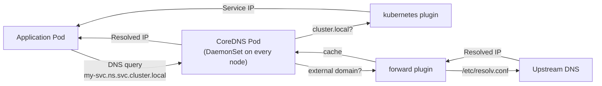
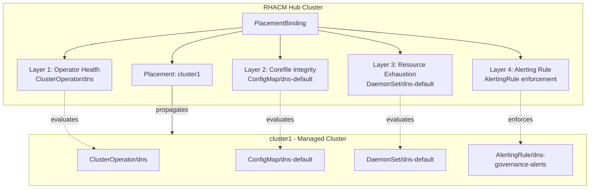
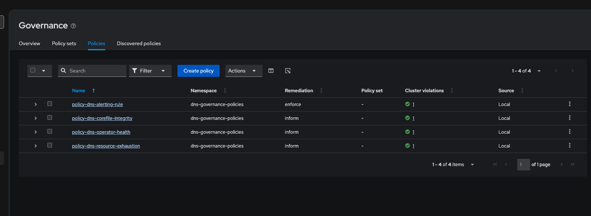

# Proactive DNS Governance for OpenShift with RHACM: From Architecture Decisions to Live Policy Enforcement

*By Tosin Akinosho | February 2026*

Every pod in an OpenShift cluster depends on DNS. Service discovery, external API calls, ingress routing — all of it flows through CoreDNS. Yet DNS is also one of the most silently-failing components in the stack. A misconfigured forwarder, a missing plugin, or an exhausted resolver pod can cause intermittent failures that take hours to diagnose.

This article describes how we built a **Policy-as-Code** framework for DNS governance using Red Hat Advanced Cluster Management (RHACM), documented every architectural decision as an ADR, and deployed the policies against a live managed cluster. The full source is available at [github.com/tosin2013/dns-policy-config](https://github.com/tosin2013/dns-policy-config).

---

## Why Architecture Decision Records for Infrastructure Policy

Architecture Decision Records (ADRs) are short documents that capture a specific design choice along with its context, rationale, and consequences. They serve three purposes in an infrastructure governance project:

1. **Compliance audit trail** — Regulators and auditors can trace each policy back to a deliberate, documented decision rather than ad-hoc configuration.
2. **Team onboarding** — New engineers understand not just *what* the policies do, but *why* they exist and what alternatives were rejected.
3. **Change management** — When a policy needs modification, the ADR provides the original context, preventing regression of past decisions.

We authored 10 ADRs covering every major decision in the DNS governance framework:

| ADR | Decision |
|-----|----------|
| [ADR-001](../../docs/adrs/0001-repository-strategy-fork-policy-collection.md) | Fork `open-cluster-management-io/policy-collection` as the repo base |
| [ADR-002](../../docs/adrs/0002-policy-remediation-mode-inform-first.md) | Use `inform` remediation mode for DNS policies (not `enforce`) |
| [ADR-003](../../docs/adrs/0003-dns-operator-health-monitoring.md) | Monitor DNS Operator health via `ClusterOperator/dns` conditions |
| [ADR-004](../../docs/adrs/0004-corefile-configuration-integrity.md) | Validate Corefile plugin integrity using `object-templates-raw` |
| [ADR-005](../../docs/adrs/0005-coredns-resource-exhaustion-detection.md) | Detect CoreDNS resource exhaustion via DaemonSet replica counts |
| [ADR-006](../../docs/adrs/0006-observability-alerting-integration.md) | Integrate with the OpenShift alerting stack via AlertingRule |
| [ADR-007](../../docs/adrs/0007-regional-dns-location-aware-policies.md) | Support regional DNS with location-aware policy templates |
| [ADR-008](../../docs/adrs/0008-dnssec-validation-monitoring.md) | Monitor DNSSEC validation when enabled |
| [ADR-009](../../docs/adrs/0009-gitops-policy-lifecycle-argocd.md) | Manage policy lifecycle via ArgoCD |
| [ADR-010](../../docs/adrs/0010-placement-api-adoption.md) | Use the Placement API over the deprecated PlacementRule |

---

## How DNS Works in OpenShift 4

Before writing policies, you need to understand what you are monitoring. OpenShift 4 uses an operator-based architecture for DNS, with three key resources forming the monitoring surface.

### The DNS Operator

The DNS Operator runs in `openshift-dns-operator` and manages the `dns.operator.openshift.io/default` custom resource. It deploys CoreDNS as a DaemonSet, ensuring every node has a local resolver. The operator reports its health through the `ClusterOperator` resource named `dns`, which exposes these conditions:

| Condition | Healthy Value | What It Means |
|-----------|--------------|---------------|
| Available | `True` | At least one CoreDNS pod is serving requests |
| Progressing | `False` | No configuration reconciliation in progress |
| Degraded | `False` | No errors in the operator or its managed resources |

### The Corefile

CoreDNS reads its configuration from a `ConfigMap` named `dns-default` in the `openshift-dns` namespace. Here is the actual Corefile observed on our hub cluster:

```
.:5353 {
    bufsize 1232
    errors
    log . { class error }
    health { lameduck 20s }
    ready
    kubernetes cluster.local in-addr.arpa ip6.arpa {
        pods insecure
        fallthrough in-addr.arpa ip6.arpa
    }
    prometheus 127.0.0.1:9153
    forward . /etc/resolv.conf { policy sequential }
    cache 900 { denial 9984 30 }
    reload
}
```

Each plugin serves a critical function: `errors` provides observability, `health` enables liveness probes, `forward` routes external queries to upstream resolvers, and `cache` prevents upstream overload. Remove any one of these, and the cluster degrades in ways that are difficult to diagnose from application logs alone.

### DNS Resolution Flow



---

## The Policy Architecture: Four Layers of Defense

A single monitoring check is not enough. DNS can fail at the operator level, the configuration level, the resource level, or silently at the metrics level. We designed four complementary policies, each targeting a different failure mode.



### Layer 1: Operator Health Monitoring (ADR-003)

The most critical check. If the DNS Operator reports `Degraded=True`, the entire cluster's name resolution is at risk. This policy uses a simple `musthave` compliance check against the `ClusterOperator` status conditions:

```yaml
object-templates:
  - complianceType: musthave
    objectDefinition:
      apiVersion: config.openshift.io/v1
      kind: ClusterOperator
      metadata:
        name: dns
      status:
        conditions:
          - type: Degraded
            status: "False"
          - type: Available
            status: "True"
```

**Severity**: `critical`. This is the first policy you should deploy in any environment.

### Layer 2: Corefile Configuration Integrity (ADR-004)

Configuration drift is a common cause of DNS failure. Someone removes a forwarding rule, the operator overwrites a manual change, or an upgrade subtly alters the plugin chain. This policy uses `object-templates-raw` — RHACM's advanced templating — to dynamically inspect the Corefile content:

```yaml
object-templates-raw: |
  {{- $cm := (lookup "v1" "ConfigMap" "openshift-dns" "dns-default") }}
  {{- if $cm }}
    {{- $corefile := $cm.data.Corefile }}
    {{- if and (contains "forward" $corefile) (contains "errors" $corefile)
              (contains "health" $corefile) (contains "cache" $corefile) }}
  - complianceType: musthave
    objectDefinition:
      apiVersion: v1
      kind: ConfigMap
      metadata:
        name: dns-default
        namespace: openshift-dns
    {{- else }}
  - complianceType: mustnothave
    objectDefinition:
      apiVersion: v1
      kind: ConfigMap
      metadata:
        name: dns-corefile-missing-required-plugins
        namespace: openshift-dns
    {{- end }}
  {{- end }}
```

Standard `musthave` compliance cannot inspect string content within ConfigMap data fields. The `object-templates-raw` approach lets us perform substring matching against the Corefile text, checking for `forward`, `errors`, `health`, and `cache` plugins.

### Layer 3: Resource Exhaustion Detection (ADR-005)

CoreDNS pods can appear "Running" while being functionally useless. If `numberAvailable < desiredNumberScheduled` on the DaemonSet, some nodes lack a local resolver. This policy compares the two values dynamically:

```yaml
object-templates-raw: |
  {{- $ds := (lookup "apps/v1" "DaemonSet" "openshift-dns" "dns-default") }}
  {{- if $ds }}
    {{- if eq ($ds.status.desiredNumberScheduled | toInt)
             ($ds.status.numberAvailable | toInt) }}
  - complianceType: musthave
    objectDefinition:
      apiVersion: apps/v1
      kind: DaemonSet
      metadata:
        name: dns-default
        namespace: openshift-dns
    {{- else }}
  - complianceType: mustnothave
    objectDefinition:
      apiVersion: v1
      kind: ConfigMap
      metadata:
        name: dns-daemonset-replicas-mismatch
        namespace: openshift-dns
    {{- end }}
  {{- end }}
```

Note the use of `toInt` — not `int`. This is a real lesson learned from our deployment. The RHACM template engine does not include the Go `int` function. Using `int` causes a template parse failure that reports as `NonCompliant` with a confusing error message. The `toInt` sprig function is the correct approach.

### Layer 4: Observability Integration (ADR-006)

A policy violation is only a signal. It must reach the on-call engineer. This policy is the one exception to our inform-first rule (ADR-002): it uses `enforce` because it *creates* a new `AlertingRule` resource rather than modifying existing DNS infrastructure.

```yaml
- alert: DNSOperatorDegraded
  expr: |
    cluster_operator_conditions{name="dns",condition="Degraded",status="true"} == 1
  for: 10m
  labels:
    severity: critical
  annotations:
    summary: "DNS Operator is in Degraded state"
    description: "The DNS ClusterOperator has been Degraded for more than 10 minutes."

- alert: DNSPodsUnavailable
  expr: |
    kube_daemonset_status_number_available{namespace="openshift-dns",daemonset="dns-default"}
    < kube_daemonset_status_desired_number_scheduled{namespace="openshift-dns",daemonset="dns-default"}
  for: 5m
  labels:
    severity: warning
  annotations:
    summary: "CoreDNS pods not available on all nodes"
```

The `for: 10m` duration prevents alerting on transient violations during legitimate operator upgrades. The AlertingRule integrates with the existing Prometheus/AlertManager stack — no additional monitoring infrastructure required.

---

## Key Design Decisions

### Inform vs. Enforce (ADR-002)

DNS is a foundational service. An `enforce` policy that contains a mistake — say, an incorrect Corefile template — could overwrite a working configuration and take down name resolution cluster-wide. We chose `inform` as the default for all monitoring policies, reserving `enforce` only for the AlertingRule (which creates a new resource, not modifying existing ones).

The path to production is: deploy in `inform` mode, validate compliance across all clusters, then selectively promote to `enforce` for individual policies after confidence is established.

### Placement API over PlacementRule (ADR-010)

RHACM provides two mechanisms for targeting managed clusters. `PlacementRule` is the legacy API, deprecated since RHACM 2.10. `Placement` is the modern API with support for `ManagedClusterSet` scoping, tolerations, and spread constraints.

We use `Placement` exclusively:

```yaml
apiVersion: cluster.open-cluster-management.io/v1beta1
kind: Placement
metadata:
  name: dns-policy-placement
  namespace: dns-governance-policies
spec:
  predicates:
    - requiredClusterSelector:
        labelSelector:
          matchExpressions:
            - key: name
              operator: In
              values:
                - cluster1
```

This requires a `ManagedClusterSetBinding` to grant the policy namespace access to the cluster's `ManagedClusterSet` — an extra resource that `PlacementRule` did not need, but one that provides built-in multi-tenancy.

### Repository Strategy (ADR-001)

We forked `open-cluster-management-io/policy-collection` rather than starting a new repository. This gives us immediate access to the upstream library of tested policies (certificates, RBAC, image policies) while providing a clear contribution path back to the community. The alternative — `redhat-cop/acm-policies` — offers a superior Kustomize-based layout for complex multi-region deployments but introduces unnecessary complexity for an initial rollout.

---

## Live Demo: Deploying to cluster1

### Environment

| Component | Details |
|-----------|---------|
| Hub Cluster | Red Hat OpenShift, RHACM 2.15.1 |
| Managed Cluster | `cluster1`, AWS us-east-1, OpenShift 4.21.2, 3 workers |
| ClusterSet | `default` |
| cluster1 Labels | `name=cluster1`, `region=us-east-1`, `cloud=Amazon`, `vendor=OpenShift` |

### Deployment Steps

The `demo/apply.sh` script automates the entire deployment:

```bash
./demo/apply.sh
```

Under the hood, it performs five steps:

**Step 1** — Create the policy namespace on the hub:

```bash
oc apply -f demo/namespace.yaml
# namespace/dns-governance-policies created
```

**Step 2** — Bind the `default` ManagedClusterSet to the namespace:

```bash
oc apply -f demo/clusterset-binding.yaml
# managedclustersetbinding.cluster.open-cluster-management.io/default created
```

**Step 3** — Apply all four DNS governance policies:

```bash
oc apply -f policies/dns/operator-health-check.yaml
oc apply -f policies/dns/corefile-integrity.yaml
oc apply -f policies/dns/resource-exhaustion.yaml
oc apply -f policies/observability/dns-alerting-rule.yaml
```

**Step 4** — Create the Placement and PlacementBinding targeting cluster1:

```bash
oc apply -f demo/placement.yaml
oc apply -f demo/placement-binding.yaml
```

**Step 5** — Wait for propagation and verify:

```bash
oc get policy -n dns-governance-policies
```

### Lesson Learned: `toInt` vs `int`

During our initial deployment, the resource exhaustion policy reported `NonCompliant` with an error:

```
template: tmpl:5: function "int" not defined
```

The RHACM config-policy-controller uses a Go template engine that includes sprig functions but not the bare Go `int` builtin. Replacing `eq (int $desired) (int $available)` with `eq ($desired | toInt) ($available | toInt)` resolved the issue immediately. This is the kind of operational knowledge that only surfaces in live deployment — and exactly why we capture it in ADR-005.

### Results

All four policies evaluated to **Compliant** on cluster1:

```
POLICY                           REMEDIATION   COMPLIANCE
policy-dns-operator-health       inform        Compliant
policy-dns-corefile-integrity    inform        Compliant
policy-dns-resource-exhaustion   inform        Compliant
policy-dns-alerting-rule         enforce       Compliant
```



The Governance dashboard in RHACM confirms: 4 policies, all in the `dns-governance-policies` namespace, each targeting 1 cluster with zero violations.

---

## What's Next

This initial deployment establishes the foundation. The roadmap includes:

**Promote to enforce** — After validating the policies across multiple clusters and upgrade cycles, selectively move individual policies from `inform` to `enforce` for self-healing DNS infrastructure.

**Regional DNS awareness (ADR-007)** — Use RHACM's `fromClusterClaim` function to make policies location-aware. A single policy template can dynamically adjust its expected Corefile forwarders based on the `region.open-cluster-management.io` cluster claim, eliminating per-region policy copies.

**GitOps lifecycle (ADR-009)** — Point an ArgoCD Application at this repository so that every Git commit automatically syncs to the hub cluster. Policy changes become pull requests with peer review, and drift detection alerts when someone edits a policy through the console.

**DNSSEC monitoring (ADR-008)** — For environments that enable DNSSEC validation, add a policy that verifies the `dnssec` plugin is configured with `log-failures` enabled, preventing silent resolution denials from expired signatures.

---

## Getting Started

1. Clone the repository:
   ```bash
   git clone https://github.com/tosin2013/dns-policy-config.git
   ```

2. Log into your RHACM hub cluster:
   ```bash
   oc login --token=<your-token> --server=<your-hub-api>
   ```

3. Edit `demo/placement.yaml` to target your managed cluster name.

4. Run the demo:
   ```bash
   ./demo/apply.sh
   ```

5. Check compliance:
   ```bash
   oc get policy -n dns-governance-policies
   ```

The full set of ADRs, policy manifests, and deployment scripts is available in the [dns-policy-config](https://github.com/tosin2013/dns-policy-config) repository.
